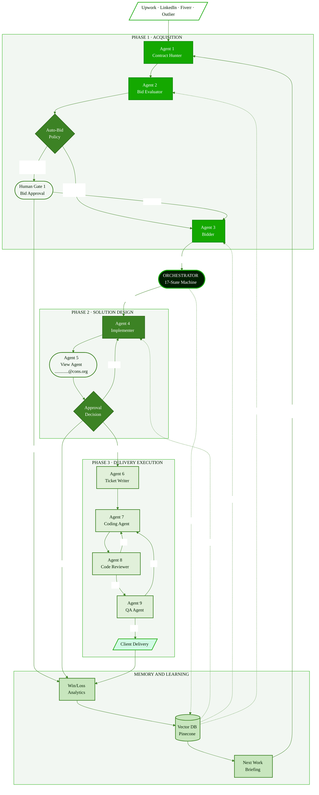

# Enterprise Agent Framework (EAF) 🏢🤖

A state-of-the-art orchestration layer for production AI systems, combining **LangGraph**, **multi-modal RAG**, and **long-term memory** for enterprise-scale autonomous agents.

---

## 🌟 Vision
Most AI agents are prototypes. EAF is built to be a resilient, scalable system that companies can deploy to handle complex, stateful multi-agent workflows with human-in-the-loop (HITL) capabilities.

---

## ✨ Key Features
- **LangGraph Orchestration**: Complex state management for cyclical and multi-agent workflows.
- **Unified RAG Stack**: Pluggable vector database support (Pinecone, Chroma, Milvus).
- **Tool-Calling Memory**: Persistent storage for tool results and agent reasoning steps.
- **FastAPI Core**: Enterprise-grade REST interface for frontend/mobile integration.

---

## 🏗️ Architecture



---

## 📁 Repository Structure
```text
enterprise-agent-framework/
├── agents/             # specialized agent definitions (LangGraph)
├── memory/             # redis/postgres persistent storage logic
├── tools/              # external API tool handlers
├── rag/                # indexing and retrieval pipelines
├── api/                # FastAPI routes and middleware
└── ui/                 # Next.js admin dashboard
```

---

## 🛠️ Tech Stack
- **Frameworks**: LangGraph, LangChain, FastAPI
- **Intelligence**: Claude 3.5 Sonnet / GPT-4o
- **Database**: PostgreSQL (State/Memory), Pinecone (Vector)
- **Deployment**: Docker, Kubernetes, GitHub Actions

---

## 🚀 Quick Start
```bash
git clone https://github.com/Alan-911/enterprise-agent-framework.git
pip install -r requirements.txt
python main.py
```

---

*Developed by Yves Alain Iragena*  
[Portfolio](https://Alan-911.github.io/my-portfolio) | [LinkedIn](https://www.linkedin.com/in/yves-alain-iragena-91b44b391/)
