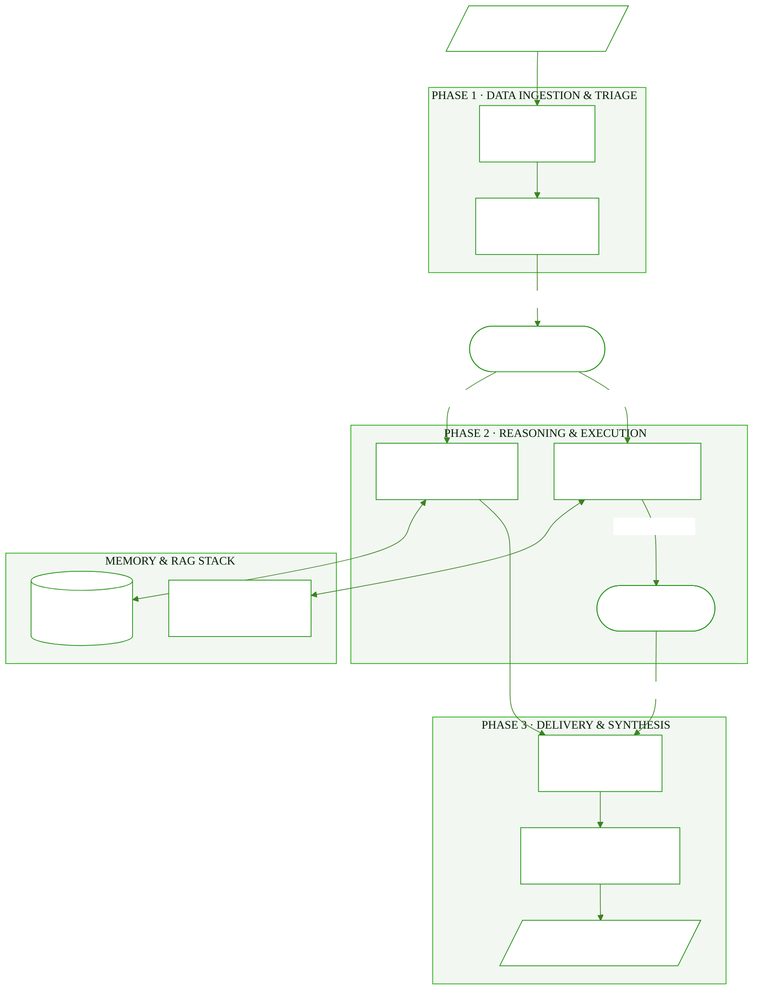

# Enterprise Agent Framework (EAF) 🏢🤖

A state-of-the-art orchestration layer for production AI systems, combining **LangGraph**, **multi-modal RAG**, and **long-term memory** for enterprise-scale autonomous agents.

---

## 🌟 Vision
Most AI agents are prototypes. EAF is built to be a resilient, scalable system that companies can deploy to handle complex, stateful multi-agent workflows with human-in-the-loop (HITL) capabilities.

---

## ✨ Key Features
- **LangGraph Orchestration**: Complex state management for cyclical and multi-agent workflows.
- **Unified RAG Stack**: Pluggable vector database support (Pinecone, Chroma, Milvus).
- **Tool-Calling Memory**: Persistent storage for tool results and agent reasoning steps.
- **FastAPI Core**: Enterprise-grade REST interface for frontend/mobile integration.

---

## 🏗️ Architecture

## 🚀 Proposal: Building AI-Augmented Applications

The traditional approach to software relies on static APIs and rigid conditional logic. This framework serves as a strategic proposal and architectural foundation for the next generation of **AI-Augmented Enterprise Applications**. 

By transitioning to an agentic architecture, businesses can:
1. **Reduce Overhead**: Automate complex, multi-step reasoning tasks that traditionally require human intervention.
2. **Increase Accuracy**: Utilize specialized agent roles (e.g., Semantic Searchers, Code Executors, QA Validation) to cross-check outputs before delivery.
3. **Maintain Safety**: Integrate strict Human-in-the-Loop (HITL) approval gates for high-risk operations while allowing autonomous execution for low-risk tasks.

### Core Implementation Strategy
- **Orchestrator Node**: Acts as the central brain, dynamically routing context between specialized agents rather than relying on linear scripts.
- **Unified Memory Stack**: Combines Vector Databases for semantic RAG with Long-Term Memory nodes to retain conversational context across sessions.
- **Decoupled Architecture**: Designed to be integrated directly into existing infrastructure via FastAPI, cleanly separating the AI logic from the frontend presentation.
